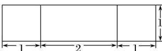
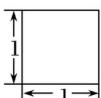
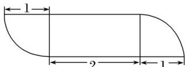

<!-- question-source:start -->
13. (2017·山东文, 13)由一个长方体和两个圆柱构成的几何体的三视图如图, 则该几何体的体积为\_\_\_\_。

  
正视图（主视图）

  
侧视图(左视图)

  
俯视图
<!-- question-source:end -->

![[高中/真题/按年份分类/2017/2017年高考真题数学_文__山东卷__含解析版_/填空题/题目/answers/Q00023498A1.md]]
