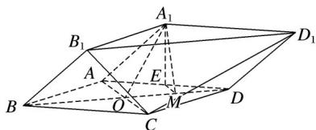

<!-- question-source:start -->
18. (2017·山东文, 18)由四棱柱 $ABCD - A_{1}B_{1}C_{1}D_{1}$ 截去三棱锥 $C_{1} - B_{1}CD_{1}$ 后得到的几何体如图所示。四边形 $ABCD$ 为正方形， $O$ 为 $AC$ 与 $BD$ 的交点， $E$ 为 $AD$ 的中点， $A_{1}E \perp$ 平面 $ABCD$ .

(1)证明： $A_{1}O$ ||平面 $B_{1}CD_{1}$ ;

(2)设 M 是 OD 的中点，证明：平面 $A_{1}EM \perp$ 平面 $B_{1}CD_{1}$ .
<!-- question-source:end -->

![[高中/真题/按年份分类/2017/2017年高考真题数学_文__山东卷__含解析版_/解答题/题目/answers/Q00023503A1.md]]
