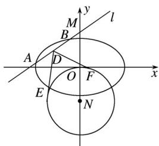

<!-- question-source:start -->
21. (2017·山东文, 21)在平面直角坐标系 $xOy$ 中, 已知椭圆 $C: + = 1(a > b > 0)$ 的离心率为, 椭圆 $C$ 截直线 $y = 1$ 所得线段的长度为 2.

(1)求椭圆 C 的方程;

(2)动直线 $l: y = kx + m (m \neq 0)$ 交椭圆 $C$ 于 $A, B$ 两点，交 $y$ 轴于点 $M$ . 点 $N$ 是 $M$ 关于 $O$ 的对称点， $\odot N$ 的半径为 $|NO|$ . 设 $D$ 为 $AB$ 的中点， $DE, DF$ 与 $\odot N$ 分别相切于点 $E, F$ ，求 $\angle EDF$ 的最小值.

##
一、选择题

## 参考答案
<!-- question-source:end -->

![[高中/真题/按年份分类/2017/2017年高考真题数学_文__山东卷__含解析版_/解答题/题目/answers/Q00030401A1.md]]
