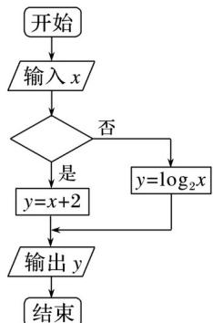

<!-- question-source:start -->
6. (2017·山东文, 6)执行下侧的程序框图, 当输入的 $x$ 值为 4 时, 输出的 $y$ 的值为 2 , 则空白判断框中的条件可能为( )

A. $x > 3$ B. $x > 4$ C. $x \leq 4$ D. $x \leq 5$
<!-- question-source:end -->

![[高中/真题/按年份分类/2017/2017年高考真题数学_文__山东卷__含解析版_/选择题/题目/answers/Q00023491A1.md]]
