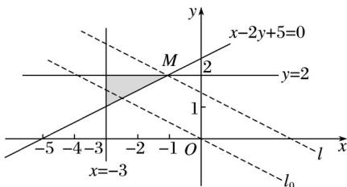

> [!faq]- 2017年高考真题数学【文】(山东卷)（含解析版）解析
>
> > [!success]- **【答案】** D
>
> > [!note]- **【分析】**
> > 本题未单列分析。
>
> > [!note]- **【解析】**
> > 画出可行域(如图阴影部分所示).
> >
> > 
> >
> > 画直线 $l_{0}$ ： $x+2y=0$ ，平移直线 $l_{0}$ 到直线 l 的位置，直线 l 过点 M.
> >
> > 解方程组得点 $M(-1,2)$
> >
> > ∴当 x=-1, y=2 时，z 取得最大值，且 $z_{\max}=-1+2\times2=3$ .
> >
> > 故选D.
