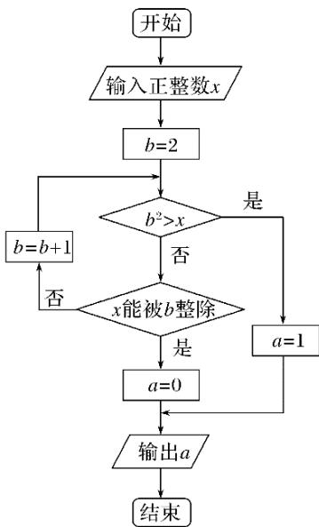

# 2017年普通高等学校招生全国统一考试（山东卷）

# 理科数学

##
一、选择题

1. (2017·山东理, 1) 设函数 $y =$ 的定义域为 $A$ , 函数 $y = \ln (1 - x)$ 的定义域为 $B$ , 则 $A \cap B$ 等于( )

A. (1,2)    B. (1,2]    C. (-2,1) D . [-2,1)

2. (2017·山东理，2)已知 $a \in \mathbf{R}$ ，i是虚数单位。若 $z = a + i$ ， $z \cdot = 4$ ，则 $a$ 等于( )

A. 1或-1

B. 或一

C. -

D.

3. (2017·山东理, 3)已知命题 $p: \forall x > 0$ , $\ln(x + 1) > 0$ ; 命题 $q$ : 若 $a > b$ , 则 $a^2 > b^2$ . 下列命题为真命题的是( )

A. $p \wedge q$ B. $p \wedge \text{綿 } q$ C. 綠 $p \wedge q$ D. 綠 $p \wedge \text{綿 } q$

4. (2017·山东理，4)已知 $x$ ， $y$ 满足约束条件则 $z = x + 2y$ 的最大值是( )

A. 0

B. 2

C. 5

D. 6

5. (2017·山东理, 5)为了研究某班学生的脚长 $x$ (单位: 厘米)和身高 $y$ (单位: 厘米)的关系,从该班随机抽取 10 名学生, 根据测量数据的散点图可以看出 $y$ 与 $x$ 之间有线性相关关系,设其回归直线方程为 $y = bx + a$ . 已知 $\sum x_{i} = 225$ , $\sum y_{i} = 1600$ , $b = 4$ . 该班某学生的脚长为 24 ,据此估计其身高为( )

A. 160 B. 163 C. 166 D. 170

6. (2017·山东理, 6)执行两次下图所示的程序框图, 若第一次输入的 $x$ 的值为 7 , 第二次输入的 $x$ 的值为 9 , 则第一次、第二次输出的 $a$ 的值分别为( )

A. 0,0 B. 1,1 C. 0,1 D. 1,0

7. (2017·山东理，7)若 $a > b > 0$ ，且 $ab = 1$ ，则下列不等式成立的是( )

A. $a + < \mathrm{log}_2(a + b)$ B. $< \mathrm{log}_2(a + b) < a+$ C. $a + < \mathrm{log}_2(a + b) <$ D. $\mathrm{log}_2(a + b) < a + <$

8. (2017·山东理, 8)从分别标有 $1,2,\dots ,9$ 的9张卡片中不放回地随机抽取2次，每次抽取1张，则抽到的2张卡片上的数奇偶性不同的概率是( )

A. B. C. D.

9. (2017·山东理, 9)在 $\triangle ABC$ 中, 角 $A, B, C$ 的对边分别为 $a, b, c$ .若 $\triangle ABC$ 为锐角三角形, 且满足 $\sin B(1+2\cos C)=2\sin A\cos C+\cos A\sin C$ , 则下列等式成立的是( )

A. $a=2b$ B. $b=2a$ C. $A=2B$ D. $B=2A$

10. (2017·山东理，10)已知当 $x \in [0,1]$ 时，函数 $y = (mx - 1)^2$ 的图象与 $y = +m$ 的图象有且只有一个交点，则正实数 $m$ 的取值范围是（ ）A. $(0,1] \cup [2, +\infty)$ B. $(0,1] \cup [3, +\infty)$ C. $(0, ] \cup [2, +\infty)$ D. $(0, ] \cup [3, +\infty)$

##

![[高中/真题/按年份分类/2017/2017年高考真题数学_理__山东卷__含解析版_/填空题/填空题.md]]
![[高中/真题/按年份分类/2017/2017年高考真题数学_理__山东卷__含解析版_/选择题/选择题.md]]
![[高中/真题/按年份分类/2017/2017年高考真题数学_理__山东卷__含解析版_/解答题/解答题.md]]
