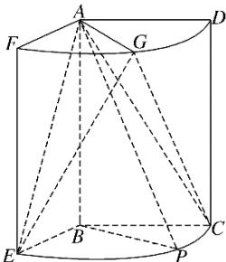

<!-- question-source:start -->
17. (2017·山东理, 17)如图, 几何体是圆柱的一部分, 它是由矩形 $ABCD$ (及其内部)以 $AB$ 边所在直线为旋转轴旋转 $120^{\circ}$ 得到的, $G$ 是的中点.

(1)设 $P$ 是上的一点，且 $AP \perp BE$ ，求 $\angle CBP$ 的大小；

(2)当 $AB = 3$ ， $AD = 2$ 时，求二面角 $E - AG - C$ 的大小.
<!-- question-source:end -->

![[高中/真题/按年份分类/2017/2017年高考真题数学_理__山东卷__含解析版_/解答题/题目/answers/Q00023481A1.md]]
