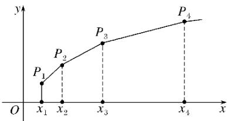

<!-- question-source:start -->
19. (2017·山东理，19)已知 $\{x_{n}\}$ 是各项均为正数的等比数列，且 $x_{1}+x_{2}=3,\quad x_{3}-x_{2}=2.$

(1)求数列 $\{x_{n}\}$ 的通项公式;

(2)如图，在平面直角坐标系 xOy 中，依次连接点 $P_{1}(x_{1},1)$ ， $P_{2}(x_{2},2)$ ，…， $P_{n+1}(x_{n+1}$ ， $n+1)$ 得

到折线 $P_{1}P_{2}\ldots P_{n + 1}$ ，求由该折线与直线 $y = 0$ ， $x = x_{1}$ ， $x = x_{n + 1}$ 所围成的区域的面积 $T_{n}$
<!-- question-source:end -->

![[高中/真题/按年份分类/2017/2017年高考真题数学_理__山东卷__含解析版_/解答题/题目/answers/Q00023483A1.md]]
