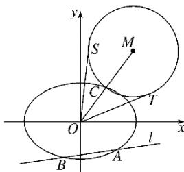

<!-- question-source:start -->
21. (2017·山东理, 21)在平面直角坐标系 $xOy$ 中, 椭圆 $E: + = 1 (a > b > 0)$ 的离心率为, 焦距为 2.

(1)求椭圆 E 的方程;

(2)如图，动直线 $l: y = k_{1}x -$ 交椭圆 $E$ 于 $A, B$ 两点， $C$ 是椭圆 $E$ 上一点，直线 $OC$ 的斜率为 $k_{2}$ ，且 $k_{1}k_{2} = .M$ 是线段 $OC$ 延长线上一点，且 $|MC|: |AB| = 2:3$ ， $\odot M$ 的半径为 $|MC|$ ， $OS$ ， $OT$ 是 $\odot M$ 的两条切线，切点分别为 $S, T$ . 求 $\angle SOT$ 的最大值，并求取得最大值时直线 $l$ 的斜率.

## 参考
<!-- question-source:end -->

![[高中/真题/按年份分类/2017/2017年高考真题数学_理__山东卷__含解析版_/解答题/题目/answers/Q00023485A1.md]]
