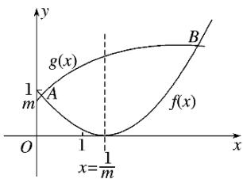
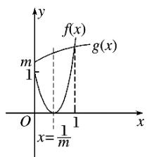

> [!faq]- 2017年高考真题数学【理】(山东卷)（含解析版）解析
>
> > [!success]- **【答案】** B
>
> > [!note]- **【分析】**
> > 本题未单列分析。
>
> > [!note]- **【解析】**
> > 在同一直角坐标系中，分别作出函数 $f(x) = (mx - 1)^2 = m^{22}$ 与 $g(x) = +m$ 的大致图象。分两种情形：
> >
> > (1)当 $0 < m \leq 1$ 时， $\geqslant 1$ ，如图①，当 $x \in [0,1]$ 时， $f(x)$ 与 $g(x)$ 的图象有一个交点，符合题意.
> >
> >   
> > ①
> >
> >   
> > ②
> >
> > (2)当 $m > 1$ 时， $0 < < 1$ ，如图②，要使 $f(x)$ 与 $g(x)$ 的图象在 $[0,1]$ 上只有一个交点，只需 $g(1) \leq f(1)$ ，即 $1 + m \leq (m - 1)^2$ ，解得 $m \geq 3$ 或 $m \leq 0$ （舍去）.
> >
> > 综上所述， $m\in(0,1]\cup[3,+\infty)$ .
> >
> > 故选B.
> >
> > ## 二、填空题
> >
> > ## 11.
> >
> > 【
