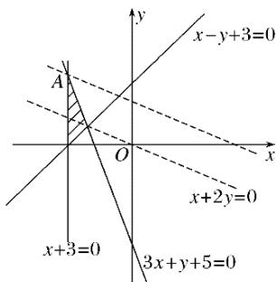

> [!faq]- 2017年高考真题数学【理】(山东卷)（含解析版）解析
>
> > [!success]- **【答案】** C
>
> > [!note]- **【分析】**
> > 本题未单列分析。
>
> > [!note]- **【解析】**
> > 如图所示，先画出可行域，
> >
> > 
> >
> > 作出直线 $l: x + 2y = 0$ .
> >
> > 由
> >
> > 解得
> >
> > $\therefore A(-3,4).$
> >
> > 由图可知，平移直线 l 至过点 A 时，z 取得最大值，
> >
> > $$
> > z _ {\max} = - 3 + 2 \times 4 = 5.
> > $$
> >
> > 故选C.
