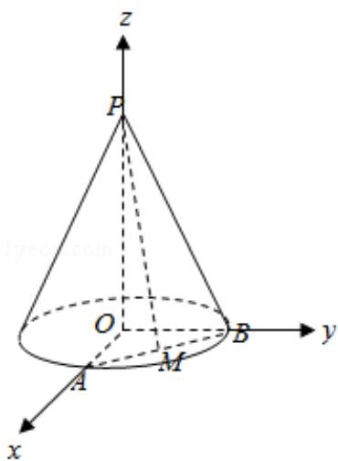

> [!faq]- 2018年上海高考数学真题试卷（word解析版）解析
>
> > [!success]- **【答案】** 详见解析
>
> > [!note]- **【分析】**
> > （1）由圆锥的顶点为 P，底面圆心为 O，半径为 2，圆锥的母线长为 4 能求
>
> > [!note]- **【解析】**
> > 解：(1)∵圆锥的顶点为P，底面圆心为O，半径为2，圆锥的母线长为4，
> >
> > ∴圆锥的体积 $V=\frac{1}{3}\times\pi\times r^{2}\times h=\frac{1}{3}\times\pi\times2^{2}\times\sqrt{4^{2}-2^{2}}$
> >
> > $$
> > = \frac {8 \sqrt {3} \pi}{3}
> > $$
> > (2) $\because PO = 4, OA, OB$ 是底面半径，且 $\angle AOB = 90^{\circ}$ ，
> >
> > M 为线段 AB 的中点，
> >
> > ∴以 O 为原点，OA 为 x 轴，OB 为 y 轴，OP 为 z 轴，
> >
> > 建立空间直角坐标系，
> >
> > P (0, 0, 4), A (2, 0, 0), B (0, 2, 0),
> >
> > M (1, 1, 0), O (0, 0, 0),
> >
> > $$
> > \overrightarrow {\mathrm{PM}} = (1, 1, - 4), \overrightarrow {\mathrm{OB}} = (0, 2, 0),
> > $$
> >
> > 设异面直线 PM 与 OB 所成的角为 $\theta$ ，
> >
> > 则 $\cos \theta = \frac{|\overrightarrow{\mathrm{PM}}\cdot\overrightarrow{\mathrm{OB}}|}{|\overrightarrow{\mathrm{PM}}|\cdot|\overrightarrow{\mathrm{OB}}|} = \frac{2}{\sqrt{18}\cdot 2} = \frac{\sqrt{2}}{6}.$
> >
> > $$
> > \therefore \theta = \arccos \frac {\sqrt {2}}{6}.
> > $$
> >
> > ∴异面直线 PM 与 OB 所成的角的为 $\arccos\frac{\sqrt{2}}{6}$ .
> >
> > 
> >
> > 【点评】本题考查圆锥的体积的求法, 考查异面直线所成角的正切值的求法, 考查
> >
> > 空间中线线、线面、面面间的位置关系等基础知识，考查运算求解能力，考查函数
> >
> > 与方程思想，是基础题。
