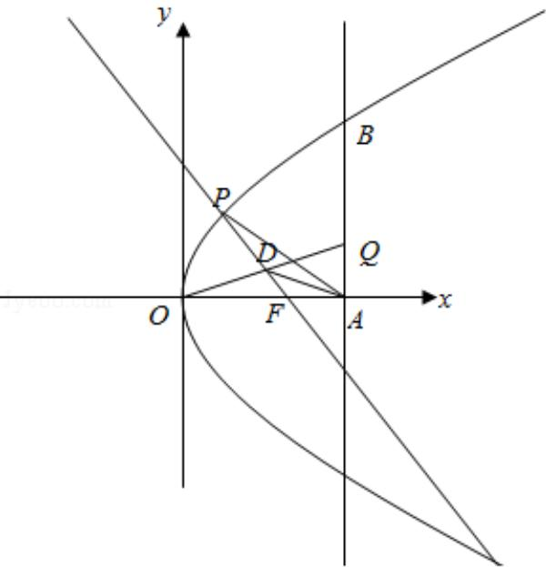

> [!faq]- 2018年上海高考数学真题试卷（word解析版）解析
>
> > [!success]- **【答案】** 详见解析
>
> > [!note]- **【分析】**
> > （1）方法一：设 B 点坐标，根据两点之间的距离公式，即可求得 $\left|BF\right|$ ;
>
> > [!note]- **【解析】**
> > 解：
> > （1）方法一：由题意可知：设 B（t， $2\sqrt{2}$ t），
> >
> > 则 $|BF| = \sqrt{(t - 2)^2 + 8t} = t + 2$ ,
> >
> > $\therefore |BF|=t+2;$
> >
> > 方法二：由题意可知：设 B（t， $2\sqrt{2}$ t），
> >
> > 由抛物线的性质可知： $|BF|=t+\frac{p}{2}=t+2,\therefore|BF|=t+2;$
> >
> > (2) F (2, 0), |FQ|=2, t=3, 则 |FA|=1,
> >
> > $\therefore |AQ|=\sqrt{3},\quad\therefore Q(3,\sqrt{2})$ ，设OQ的中点D，
> >
> > D $\left(\frac{3}{2},\frac{\sqrt{2}}{2}\right)$ ,
> >
> > $k_{QF}=\frac{\frac{\sqrt{3}}{2}-0}{\frac{3}{2}-2}=-\sqrt{3}$ ，则直线 PF 方程： $y=-\sqrt{3}(x-2)$ ，
> >
> > 联立 $\left\{ \begin{array}{l} y = -\sqrt{3}(x - 2) \\ y^2 = 8x \end{array} \right.$ ，整理得： $3x^2 - 20x + 12 = 0$
> >
> > 解得： $x=\frac{2}{3}$ ，x=6（舍去），
> >
> > $\therefore \triangle AQP$ 的面积 $S = \frac{1}{2} \times \sqrt{3} \times \frac{7}{3} = \frac{7\sqrt{3}}{6}$ ;
> > (3) 存在，设 $P\left(\frac{y^2}{8}, y\right)$ ， $E\left(\frac{m^2}{8}, m\right)$ ，则 $k_{PF} = \frac{\frac{y}{y^2}}{\frac{y}{8} - 2} = \frac{8y}{y^2 - 16}$ ， $k_{FQ} = \frac{16 - y^2}{8y}$ ，
> >
> > 直线 QF 方程为 $y=\frac{16-y^{2}}{8y}(x-2)$ ，∴ $y_{Q}=\frac{16-y^{2}}{8y}(8-2)=\frac{48-3y^{2}}{4y}$ ， $Q(8,\frac{48-3y^{2}}{4y})$ ，
> >
> > 根据 $\overrightarrow{FP} +\overrightarrow{FQ} = \overrightarrow{FE}$ ，则E $(\frac{y^2}{8} +6,\frac{48 + y^2}{4y})$
> >
> > $\therefore \left(\frac{48 + y^2}{4y}\right)^2 = 8\left(\frac{y^2}{8} +6\right)$ ，解得： $y^{2} = \frac{16}{5}$
> >
> > ∴存在以FP、FQ为邻边的矩形FPEQ，使得点E在Γ上，且P（ $\frac{2}{5}$ ， $\frac{4\sqrt{5}}{5}$ ）
> >
> > 
> >
> > 【点评】本题考查抛物线的性质, 直线与抛物线的位置关系, 考查转化思想, 计算
> > 能力，属于中档题.
