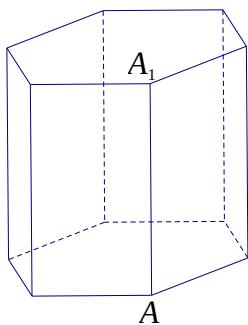

<!-- question-source:start -->
14. 已知 $a \in R$ ，则 “a > 1” 是 “ $\frac{1}{a} < 1$ ” 的 ()
(A) 充分非必要条件 (B) 必要非充分条件
(C) 充要条件 (D) 既非充分又非必要条件

<!-- question-source:end -->

![[高中/真题/按年份分类/2018/2018年上海高考数学真题试卷_word解析版_/选择题/题目/answers/Q00023908A1.md]]
