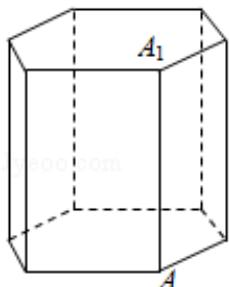

<!-- question-source:start -->
15. (5 分) (2018•上海)《九章算术》中, 称底面为矩形而有一侧棱垂直于底面的四棱锥为阳马, 设 $\mathrm{AA}_{1}$ 是正六棱柱的一条侧棱, 如图, 若阳马以该正六棱柱的顶点为顶点、以 $\mathrm{AA}_{1}$ 为底面矩形的一边, 则这样的阳马的个数是 ( )

A. 4B. 8C. 12 D. 16

【考点】D8：排列、组合的实际应用.

【专题】11：计算题；38：对应思想；4R：转化法；5O：排列组合.

【
<!-- question-source:end -->

![[高中/真题/按年份分类/2018/2018年上海高考数学真题试卷_word解析版_/选择题/题目/answers/Q00028758A1.md]]
