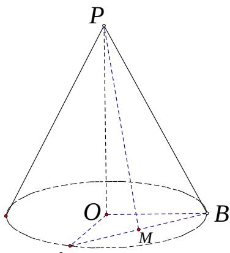

<!-- question-source:start -->
(2) 设 $PO = 4$ ， $OA$ 、 $OB$ 是底面半径，且 $\angle AOB = 90^{\circ}$ ，

  
A

M 为线段 AB 的中点，如图，求异面直线 PM 与 OB 所成的角的大小。
<!-- question-source:end -->

![[高中/真题/按年份分类/2018/2018年上海高考数学真题试卷_word解析版_/选择题/题目/answers/Q00031312A1.md]]
