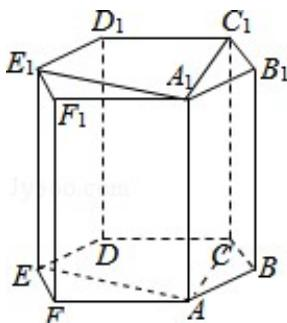

> [!faq]- 2018年上海高考数学真题试卷（word解析版）解析
>
> > [!success]- **【答案】** . 【
>
> > [!note]- **【分析】**
> > 根据新定义和正六边形的性质可得
>
> > [!note]- **【解析】**
> > 解：根据正六边形的性质，则 $D_{1}-A_{1}ABB_{1}$ ， $D_{1}-A_{1}AFF_{1}$ 满足题意，而
> >
> > $C_{1}$ ， $E_{1}$ ，C，D，E，和 $D_{1}$ 一样，有 $2\times6=12$ ，
> >
> > 当 $A_{1}ACC_{1}$ 为底面矩形，有 2 个满足题意，
> >
> > 当 $A_{1}AEE_{1}$ 为底面矩形，有 2 个满足题意，
> >
> > 故有 $12+2+2=16$
> >
> > 故选：D.
> >
> > 
> >
> > 【点评】本题考查了新定义，以及排除组合的问题，考查了棱柱的特征，属于中档题.
