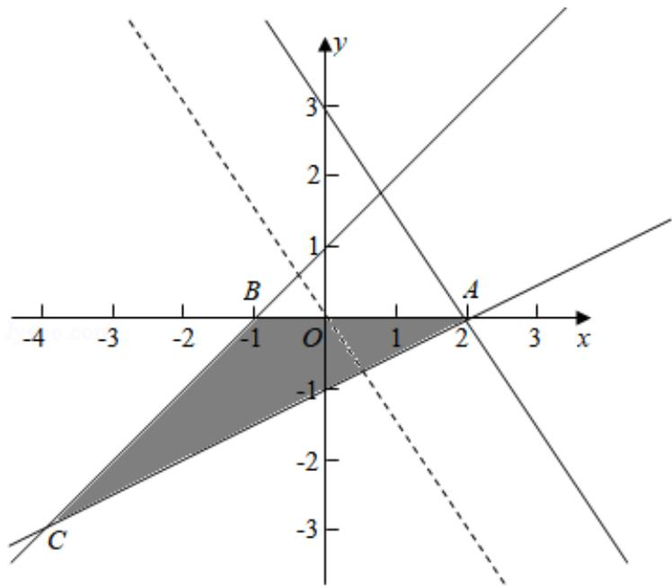

> [!faq]- 2018年全国统一高考数学试卷（文科）（新课标ⅰ）（含解析版）解析
>
> > [!success]- **【答案】** 为：6  【点评】本题主要考查线性规划的应用，利用目标函数的几何意义以及数形结合 是解决本题的关键.
>
> > [!note]- **【分析】**
> > 作出不等式组对应的平面区域, 利用目标函数的几何意义进行求解即可.
>
> > [!note]- **【解析】**
> > 分析】作出不等式组对应的平面区域, 利用目标函数的几何意义进行求解即可.
> >
> > 【
> > 解答】解：作出不等式组对应的平面区域如图：
> >
> > 由 $z = 3x + 2y$ 得 $y = -\frac{3}{2} x + \frac{1}{2} z,$
> >
> > 平移直线 $y = -\frac{3}{2} x + \frac{1}{2} z$ ，
> >
> > 由图象知当直线 $y = -\frac{3}{2} x + \frac{1}{2} z$ 经过点A(2,0)时，直线的截距最大，此时z最大，
> >
> > 最大值为 $z=3\times2=6$ ，
> >
> > 故
> > 答案为：6
> >
> > 
> >
> > 【点评】本题主要考查线性规划的应用，利用目标函数的几何意义以及数形结合
> >
> > 是解决本题的关键.
