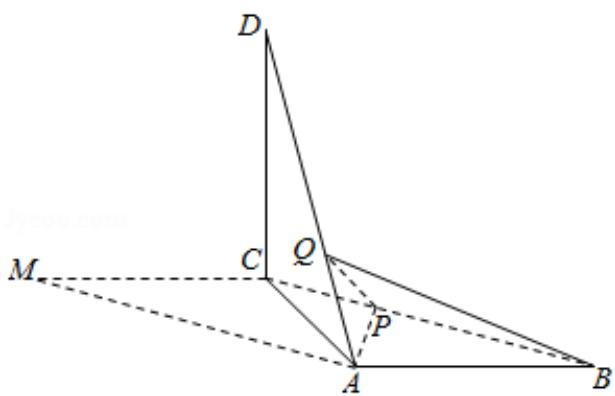

<!-- question-source:start -->
18. (12 分) 如图, 在平行四边形 ABCM 中, AB=AC=3, $\angle ACM=90^{\circ}$ , 以 AC 为折痕将 $\triangle ACM$ 折起, 使点 M 到达点 D 的位置, 且 AB⊥DA.

(1) 证明: 平面 ACD⊥平面 ABC;

(2) Q 为线段 AD 上一点, P 为线段 BC 上一点, 且 BP=DQ= $\frac{2}{3}$ DA, 求三棱锥 Q - ABP 的体积.

<!-- question-source:end -->

![[高中/真题/按年份分类/2018/2018年全国统一高考数学试卷_文科__新课标ⅰ__含解析版_/解答题/题目/answers/Q00024674A1.md]]
