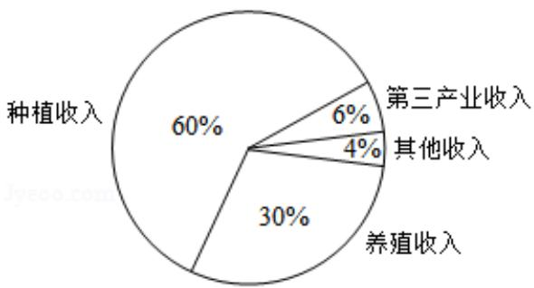

<!-- question-source:start -->
3. (5 分) 某地区经过一年的新农村建设, 农村的经济收入增加了一倍, 实现翻番.
为更好地了解该地区农村的经济收入变化情况, 统计了该地区新农村建设前
后农村的经济收入构成比例, 得到如下饼图:

  
建设前经济收入构成比例

  
建设后经济收入构成比例

则下面结论中不正确的是（）
A. 新农村建设后，种植收入减少

B. 新农村建设后，其他收入增加了一倍以上  
C. 新农村建设后，养殖收入增加了一倍  
D. 新农村建设后，养殖收入与第三产业收入的总和超过了经济收入的一半
<!-- question-source:end -->

![[高中/真题/按年份分类/2018/2018年全国统一高考数学试卷_文科__新课标ⅰ__含解析版_/选择题/题目/answers/Q00024659A1.md]]
