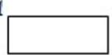
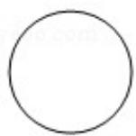

<!-- question-source:start -->
8. （5分）已知函数 $f(x) = 2\cos^2 x - \sin^2 x + 2$ ，则（）
A. $f(x)$ 的最小正周期为 $\pi$ ，最大值为3
B. $f(x)$ 的最小正周期为 $\pi$ ，最大值为4

C. $f(x)$ 的最小正周期为 $2\pi$ ，最大值为3D. $f(x)$ 的最小正周期为 $2\pi$ ，最大值为4
<!-- question-source:end -->

![[高中/真题/按年份分类/2018/2018年全国统一高考数学试卷_文科__新课标ⅰ__含解析版_/选择题/题目/answers/Q00024664A1.md]]
