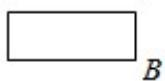

<!-- question-source:start -->
9. (5 分) 某圆柱的高为 2, 底面周长为 16, 其三视图如图. 圆柱表面上的点 M 在正视图上的对应点为 A, 圆柱表面上的点 N 在左视图上的对应点为 B, 则在此

圆柱侧面上，从 M 到 N 的路径中，最短路径的长度为（）

A. $2\sqrt{17}$ B. $2\sqrt{5}$ C. 3 D. 2
<!-- question-source:end -->

![[高中/真题/按年份分类/2018/2018年全国统一高考数学试卷_文科__新课标ⅰ__含解析版_/选择题/题目/answers/Q00024665A1.md]]
