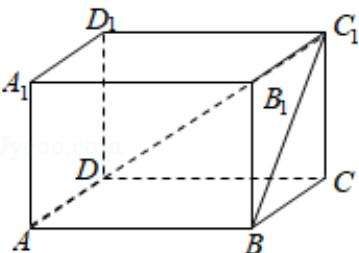

> [!faq]- 2018年全国统一高考数学试卷（文科）（新课标ⅰ）（含解析版）解析
>
> > [!success]- **【答案】** C
>
> > [!note]- **【分析】**
> > 画出图形，利用已知条件求出长方体的高，然后求解长方体的体积即可.
>
> > [!note]- **【解析】**
> > 分析】画出图形，利用已知条件求出长方体的高，然后求解长方体的体积即可.
> >
> > 【
> > 解答】解：长方体 ABCD - A₁B₁C₁D₁ 中，AB=BC=2，
> >
> > $AC_{1}$ 与平面 $BB_{1}C_{1}C$ 所成的角为 $30^{\circ}$ ,
> >
> > 即 $\angle AC_{1}B = 30^{\circ}$ ，可得 $BC_{1} = \frac{AB}{\tan 30^{\circ}} = 2\sqrt{3}$
> >
> > 可得 $\mathrm{BB}_1 = \sqrt{(2\sqrt{3})^2 - 2^2} = 2\sqrt{2}$ .
> >
> > 所以该长方体的体积为： $2 \times 2 \times 2\sqrt{2} = 8\sqrt{2}$ .
> >
> > 故选：C.
> >
> > 
> >
> > 【点评】本题考查长方体的体积的求法, 直线与平面所成角的求法, 考查计算能力.
