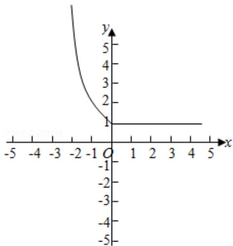

> [!faq]- 2018年全国统一高考数学试卷（文科）（新课标ⅰ）（含解析版）解析
>
> > [!success]- **【答案】** D
>
> > [!note]- **【分析】**
> > 画出函数的图象，利用函数的单调性列出不等式转化求解即可.
>
> > [!note]- **【解析】**
> > 分析】画出函数的图象，利用函数的单调性列出不等式转化求解即可.
> >
> > 【
> > 解答】解：函数 $f(x) = \begin{cases} 2^{-x}, & x \leqslant 0 \\ 1, & x > 0 \end{cases}$ ，的图象如图：
> >
> > 满足 $f(x+1) < f(2x)$ ，
> >
> > 可得： $2x<0<x+1$ 或 $2x<x+1\leq0$ ，
> >
> > 解得 $x \in (-\infty, 0)$ .
> >
> > 故选：D.
> >
> > 
> >
> > 【点评】本题考查分段函数的应用, 函数的单调性以及不等式的解法, 考查计算能力.
> >
> > ## 二、填空题：本题共4小题，每小题5分，共20分。
