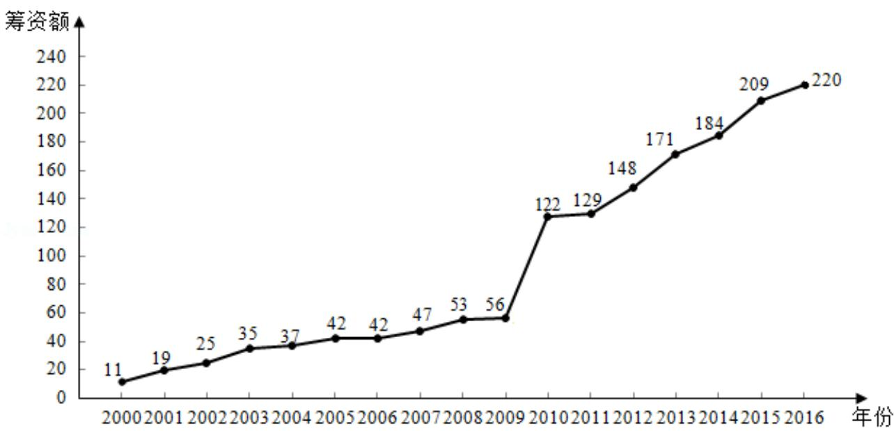

<!-- question-source:start -->
18. (12 分) 如图是某地区 2000 年至 2016 年环境基础设施投资额 y (单位: 亿元)  
  
为了预测该地区2018年的环境基础设施投资额，建立了y与时间变量t的两个线

…,17) 建立模型①: $\hat{y} = -30.4 + 13.5t$ ; 根据 2010 年至 2016 年的数据 (时间变量

t 的值依次为 1, 2, ..., 7) 建立模型②: $\hat{y}=99+17.5t$ .

(1) 分别利用这两个模型，求该地区 2018 年的环境基础设施投资额的预测值；

(2) 你认为用哪个模型得到的预测值更可靠？并说明理由。
<!-- question-source:end -->

![[高中/真题/按年份分类/2018/2018年全国统一高考数学试卷_文科__新课标ⅱ__含解析版_/解答题/题目/answers/Q00025090A1.md]]
