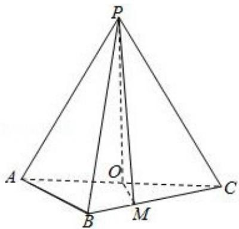

<!-- question-source:start -->
19. (12 分) 如图, 在三棱锥 P - ABC 中, $AB = BC = 2\sqrt{2}$ , $PA = PB = PC = AC = 4$ , O 为 AC 的中点.

(1) 证明: PO⊥平面 ABC;

(2) 若点 M 在棱 BC 上，且 MC=2MB，求点 C 到平面 POM 的距离.

<!-- question-source:end -->

![[高中/真题/按年份分类/2018/2018年全国统一高考数学试卷_文科__新课标ⅱ__含解析版_/解答题/题目/answers/Q00025091A1.md]]
