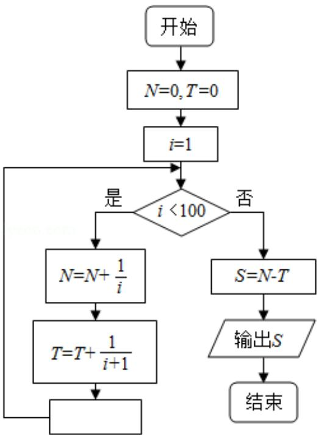

<!-- question-source:start -->
8. (5 分) 为计算 $S = 1 - \frac{1}{2} + \frac{1}{3} - \frac{1}{4} + \ldots + \frac{1}{99} - \frac{1}{100}$ ，设计了如图的程序框图，则在空白框中应填入（）

A. $i = i + 1$ B. $i = i + 2$ C. $i = i + 3$ D. $i = i + 4$
<!-- question-source:end -->

![[高中/真题/按年份分类/2018/2018年全国统一高考数学试卷_文科__新课标ⅱ__含解析版_/选择题/题目/answers/Q00025080A1.md]]
