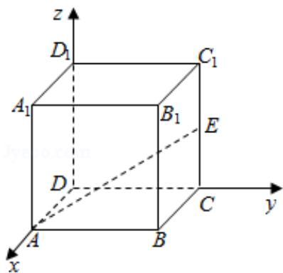

> [!faq]- 2018年全国统一高考数学试卷（文科）（新课标ⅱ）（含解析版）解析
>
> > [!success]- **【答案】** C
>
> > [!note]- **【分析】**
> > 以 D 为原点，DA 为 x 轴，DC 为 y 轴， $DD_{1}$ 为 z 轴，建立空间直角坐标系，
>
> > [!note]- **【解析】**
> > 解以 D 为原点，DA 为 x 轴，DC 为 y 轴， $DD_{1}$ 为 z 轴，建立空间直角坐标系，
> >
> > 设正方体 ABCD - A $_{1}$ B $_{1}$ C $_{1}$ D $_{1}$ 棱长为 2，
> >
> > 则 A $(2, 0, 0)$ ，E $(0, 2, 1)$ ，D $(0, 0, 0)$ ，
> >
> > C $(0, 2, 0)$
> >
> > $$
> > \overrightarrow {\mathrm{AE}} = (- 2, 2, 1), \overrightarrow {\mathrm{CD}} = (0, - 2, 0),
> > $$
> >
> > 设异面直线 AE 与 CD 所成角为 $\theta$ ，
> >
> > 则 $\cos \theta = \frac{|\overrightarrow{\mathrm{AE}}\cdot\overrightarrow{\mathrm{CD}}|}{|\overrightarrow{\mathrm{AE}}|\cdot|\overrightarrow{\mathrm{CD}}|} = \frac{4}{\sqrt{9}\cdot 2} = \frac{2}{3},$
> >
> > $$
> > \sin \theta = \sqrt {1 - (\frac {2}{3}) ^ {2}} = \frac {\sqrt {5}}{3},
> > $$
> >
> > $$
> > \therefore \tan \theta = \frac {\sqrt {5}}{2}.
> > $$
> >
> > ∴异面直线 AE 与 CD 所成角的正切值为 $\frac{\sqrt{5}}{2}$ .
> >
> > 故选：C.
> >
> > 
> >
> > 【点评】本题考查异面直线所成角的正切值的求法，考查空间角等基础知识，考查
> >
> > 运算求解能力，考查函数与方程思想，是基础题.
