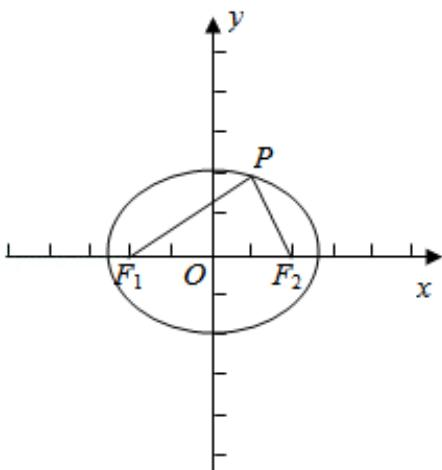

> [!faq]- 2018年全国统一高考数学试卷（文科）（新课标ⅱ）（含解析版）解析
>
> > [!success]- **【答案】** D
>
> > [!note]- **【分析】**
> > 利用已知条件求出 P 的坐标, 代入椭圆方程, 然后求解椭圆的离心率即可
>
> > [!note]- **【解析】**
> > 解: $F_{1}$ , $F_{2}$ 是椭圆 C 的两个焦点, P 是 C 上的一点, 若 $PF_{1} \perp PF_{2}$ , 且 $\angle PF_{2}F_{1}=60^{\circ}$ , 可得椭圆的焦点坐标 $F_{2}(c,0)$ ,
> >
> > 所以 $\mathrm{P}\left(\frac{1}{2}\mathrm{c},\frac{\sqrt{3}}{2}\mathrm{c}\right)$ 。可得： $\frac{\mathrm{c}^2}{4\mathrm{a}^2} +\frac{3\mathrm{c}^2}{4\mathrm{b}^2} = 1$ ，可得 $\frac{1}{4}\mathrm{e}^2 +\frac{3}{4(\frac{1}{\mathrm{e}^2} - 1)} = 1$ ，可得 $\mathrm{e}^4-$ $8\mathrm{e}^{2} + 4 = 0,\mathrm{e}\in (0,1)$
> >
> > 解得 $e=\sqrt{3}-1$ .
> >
> > 故选：D.
> >
> > 
> >
> > 【点评】本题考查椭圆的简单性质的应用，考查计算能力.
