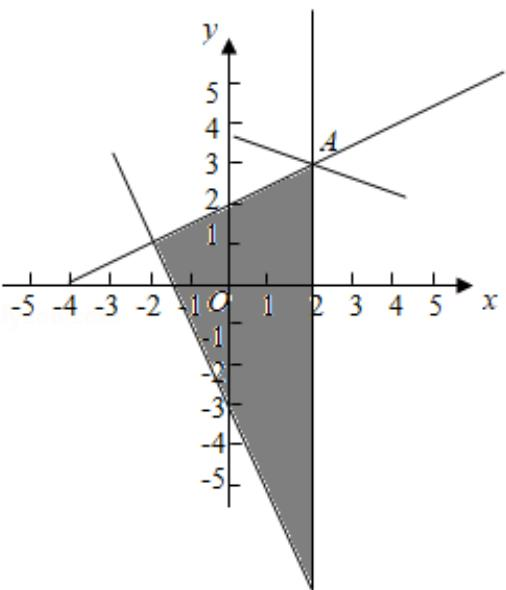

> [!faq]- 2018年全国统一高考数学试卷（文科）（新课标ⅲ）（含解析版）解析
>
> > [!success]- **【答案】** 为：3.  【点评】本题考查画不等式组表示的平面区域、考查数形结合求函数的最值.
>
> > [!note]- **【分析】**
> > 作出不等式组表示的平面区域；作出目标函数对应的直线；结合图象知当
>
> > [!note]- **【解析】**
> > 分析】作出不等式组表示的平面区域；作出目标函数对应的直线；结合图象知当
> >
> > 直线过（2，3）时，z 最大.
> >
> > 【
> > 解答】解：画出变量 x，y 满足约束条件 $\left\{\begin{aligned}&2x+y+3\geqslant0\\&x-2y+4\geqslant0\\&x-2\leqslant0\end{aligned}\right.$ 表示的平面区域如图：由 $\left\{\begin{aligned}&x=2\\&x-2y+4=0\end{aligned}\right.$ 解得 A（2，3）. $z=x+\frac{1}{3}y$ 变形为 $y=-3x+3z$ ，作出目标函数对应的直线，
> > 当直线过 A（2，3）时，直线的纵截距最小，z 最大，
> > 最大值为 $2+3\times\frac{1}{3}=3$ ，
> >
> > 故
> > 答案为：3.
> >
> > 
> >
> > 【点评】本题考查画不等式组表示的平面区域、考查数形结合求函数的最值.
