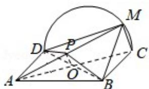

> [!faq]- 2018年全国统一高考数学试卷（文科）（新课标ⅲ）（含解析版）解析
>
> > [!success]- **【答案】** （12分）如图，矩形ABCD所在平面与半圆弧 $\widehat{\mathrm{CD}}$ 所在平面垂直，M是 $\widehat{\mathrm{CD}}$ 上异于C，D的点
>
> > [!note]- **【分析】**
> > （1）通过证明 CD⊥AD，CD⊥DM，证明 CM⊥平面 AMD，然后证明平面
>
> > [!note]- **【解析】**
> > （1）证明：矩形ABCD所在平面与半圆弦CD所在平面垂直，所以AD⊥半圆
> >
> > 弦 $\widehat{CD}$ 所在平面，CMC半圆弦 $\widehat{CD}$ 所在平面，
> >
> > $\therefore CM \perp AD,$
> >
> > M 是 $\widehat{CD}$ 上异于 C, D 的点. $\therefore CM \perp DM$ , $DM \cap AD = D$ , $\therefore CM \perp$ 平面 AMD, $CM \subset$ 平面
> >
> > CMB,
> >
> > ∴平面 AMD⊥平面 BMC;
> > (2) 解: 存在 P 是 AM 的中点,
> >
> > 理由：
> >
> > 连接 BD 交 AC 于 O，取 AM 的中点 P，连接 OP，可得 MC||OP，MC∉平面 BDP，OP⊂
> >
> > 平面 BDP，
> >
> > 所以 MC∥平面 PBD.
> >
> > 
