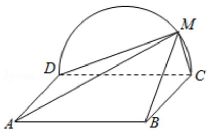

<!-- question-source:start -->
19. (12 分) 如图, 矩形 ABCD 所在平面与半圆弧 $\widehat{CD}$ 所在平面垂直, M 是 $\widehat{CD}$ 上异于 C, D 的点.

(1) 证明: 平面 AMD⊥平面 BMC;

(2) 在线段 AM 上是否存在点 P，使得 MC∥平面 PBD？说明理由.

<!-- question-source:end -->

![[高中/真题/按年份分类/2018/2018年全国统一高考数学试卷_文科__新课标ⅲ__含解析版_/解答题/题目/answers/Q00024193A1.md]]
