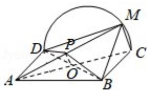

> [!faq]- 2018年全国统一高考数学试卷（文科）（新课标ⅲ）（含解析版）解析
>
> > [!success]- **【答案】** 详见解析
>
> > [!note]- **【分析】**
> > （1）通过证明 CD⊥AD, CD⊥DM, 证明 CM⊥平面 AMD, 然后证明平面
>
> > [!note]- **【解析】**
> > 分析】（1）通过证明 CD⊥AD, CD⊥DM, 证明 CM⊥平面 AMD, 然后证明平面
> >
> > AMD⊥平面 BMC;
> >
> > (2) 存在 P 是 AM 的中点，利用直线与平面培训的判断定理说明即可.
> >
> > 【
> > 解答】（1）证明：矩形 ABCD 所在平面与半圆弦 CD 所在平面垂直，所以 AD ⊥ 半
> >
> > 圆弦CD所在平面，CMC半圆弦CD所在平面，
> >
> > ∴CM⊥AD,
> >
> > M 是 CD 上异于 C, D 的点. ∴ CM ⊥ DM, DM ∩ AD = D, ∴ CM ⊥ 平面 AMD, CM ⊂ 平
> >
> > 面CMB，
> >
> > ∴平面 AMD⊥平面 BMC;
> >
> > (2) 解: 存在 $\mathrm{P}$ 是 AM 的中点,
> >
> > 理由：连接 BD 交 AC 于 O，取 AM 的中点 P，连接 OP，可得 MC||OP，
> >
> > MC∠平面 BDP，OP⊂平面 BDP，
> >
> > 所以 MC||平面 PBD.
> >
> > 
> >
> > 【点评】本题考查直线与平面垂直的判断定理以及性质定理的应用，直线与平面
> >
> > 培训的判断定理的应用，考查空间想象能力以及逻辑推理能力。
