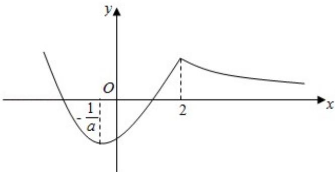

> [!faq]- 2018年全国统一高考数学试卷（文科）（新课标ⅲ）（含解析版）解析
>
> > [!success]- **【答案】** 详见解析
>
> > [!note]- **【分析】**
> > 本题未单列分析。
>
> > [!note]- **【解析】**
> > 解：
> > （1） $f'(x)=\frac{(2ax+1)e^{x}-(ax^{2}+x-1)e^{x}}{(e^{x})^{2}}=-\frac{(ax+1)(x-2)}{e^{x}}$
> >
> > $\therefore f'(0)=2$ ，即曲线 y=f(x) 在点 $(0,-1)$ 处的切线斜率 k=2，
> >
> > ∴曲线 y=f (x) 在点 $(0, -1)$ 处的切线方程方程为 $y - (-1) = 2x$ .
> >
> > 即 2x - y - 1 = 0 为所求.
> > (2) 证明: 函数 $f(x)$ 的定义域为: $R$ ,
> >
> > 可得 $f'(x)=\frac{(2ax+1)e^{x}-(ax^{2}+x-1)e^{x}}{(e^{x})^{2}}=-\frac{(ax+1)(x-2)}{e^{x}}$ .
> >
> > 令 $f'(x) = 0$ ，可得 $x_1 = 2$ ， $x_2 = \frac{1}{a} < 0$ ，
> >
> > 当 $x \in (-\infty, -\frac{1}{a})$ 时， $f'(x) < 0, x \in (-\frac{1}{a}, 2)$ 时， $f'(x) > 0, x \in (2, +\infty)$ 时， $f'(x) <$
> >
> > 0.
> >
> > $\therefore f(x)$ 在 $(- \infty, -\frac{1}{a})$ ， $(2, +\infty)$ 递减，在 $(- \frac{1}{a}, 2)$ 递增，
> >
> > 注意到 $a \geq 1$ 时，函数 $g(x) = ax^2 + x - 1$ 在 $(2, +\infty)$ 单调递增，且 $g(2) = 4a + 1 > 0$
> >
> > 函数 $f(x)$ 的图象如下:
> >
> > 
> >
> > $\because a \geq 1, \therefore \frac{1}{a} \in (0, 1]$ ，则 $f\left(-\frac{1}{a}\right) = -e^{\frac{1}{a}} \geqslant -e$
> >
> > $\therefore f(x)_{\min} = -e^{\frac{1}{a}} \geqslant -e,$
> >
> > ∴当 $a \geq 1$ 时， $f(x) + e \geq 0$ .
> >
> > 【点评】本题考查了导数的几何意义，及利用导数求单调性、最值，考查了数形结
> >
> > 合思想，属于中档题.
> >
> > (二) 选考题: 共 10 分。请考生在第 22、23 题中任选一题作答。如果多做, 则按所
> >
> > 做的第一题计分。[选修 4-4：坐标系与参数方程]（10 分）
