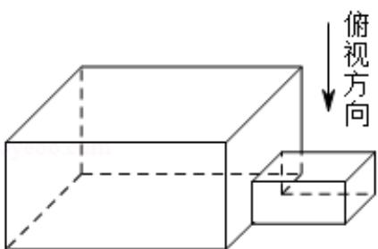
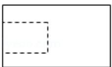
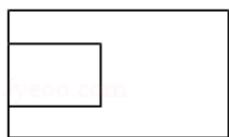
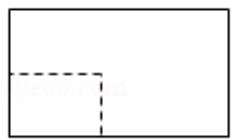
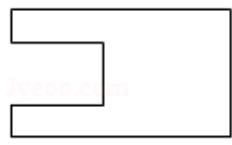

<!-- question-source:start -->
3. (5 分) 中国古建筑借助榫卯将木构件连接起来. 构件的凸出部分叫榫头, 凹进
部分叫卵眼, 图中木构件右边的小长方体是榫头. 若如图摆放的木构件与某一
带卵眼的木构件咬合成长方体, 则咬合时带卵眼的木构件的俯视图可以是 ( )

A.

B.

C.

D.
<!-- question-source:end -->

![[高中/真题/按年份分类/2018/2018年全国统一高考数学试卷_文科__新课标ⅲ__含解析版_/选择题/题目/answers/Q00026522A1.md]]
