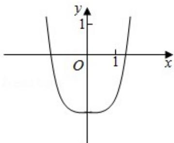
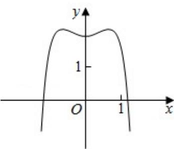

<!-- question-source:start -->
9. (5 分) 函数 $y = -x^4 + x^2 + 2$ 的图象大致为（）

  
A.

  
B.

C.

D.
<!-- question-source:end -->

![[高中/真题/按年份分类/2018/2018年全国统一高考数学试卷_文科__新课标ⅲ__含解析版_/选择题/题目/answers/Q00026527A1.md]]
