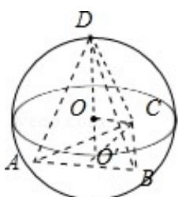

> [!faq]- 2018年全国统一高考数学试卷（文科）（新课标ⅲ）（含解析版）解析
>
> > [!success]- **【答案】** B
>
> > [!note]- **【分析】**
> > 求出, $\triangle ABC$ 为等边三角形的边长, 画出图形, 判断 D 的位置, 然后求解即可.
>
> > [!note]- **【解析】**
> > 解： $\triangle ABC$ 为等边三角形且面积为 $9\sqrt{3}$ ，可得 $\frac{\sqrt{3}}{4} \times AB^2 = 9\sqrt{3}$ ，解得 $AB = 6$ ，
> >
> > 球心为 O，三角形 ABC 的外心为 $O'$ ，显然 D 在 $O'O$ 的延长线与球的交点如图：
> >
> > $$
> > \mathrm{O} ^ {\prime} \mathrm{C} = \frac {2}{3} \times \frac {\sqrt {3}}{2} \times 6 = 2 \sqrt {3}, \quad \mathrm{OO} ^ {\prime} = \sqrt {4 ^ {2} - (2 \sqrt {3}) ^ {2}} = 2,
> > $$
> >
> > 则三棱锥 D - ABC 高的最大值为：6，
> >
> > 则三棱锥 D-ABC 体积的最大值为： $\frac{1}{3}\times\frac{\sqrt{3}}{4}\times6^{3}=18\sqrt{3}$ .
> >
> > 故选：B.
> >
> > 
> >
> > 【点评】本题考查球的内接多面体，棱锥的体积的求法，考查空间想象能力以及计
> >
> > 算能力.
> >
> > ##
> > 二、填空题：本题共4小题，每小题5分，共20分。
