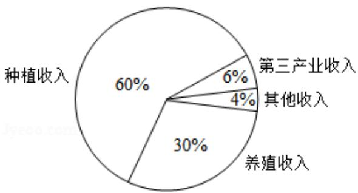
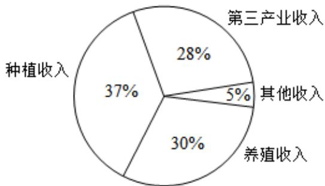
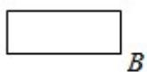
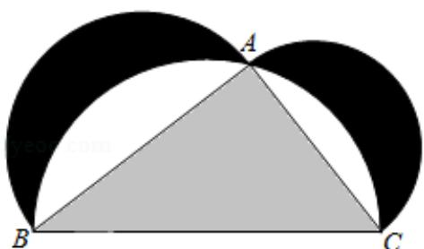

# 2018 年全国统一高考数学试卷（理科）（新课标 I）

##
一、选择题：本题共12小题，每小题5分，共60分。在每小题给出的四个选项中，只有一项是符合题目要求的。

1. （5分）设 $z = \frac{1 - i}{1 + i} + 2i$ ，则 $|z| =$ （）
A. 0 B. $\frac{1}{2}$ C. 1 D. $\sqrt{2}$

2. （5分）已知集合 $A = \{x | x^2 - x - 2 > 0\}$ ，则 $C_R A = (\quad)$ A. $\{x| - 1 < x < 2\}$ B. $\{x| - 1 \leq x \leq 2\}$ C. $\{x | x < -1\} \cup \{x | x > 2\}$ D. $\{x | x \leq -1\} \cup \{x | x \geq 2\}$

3. (5 分) 某地区经过一年的新农村建设, 农村的经济收入增加了一倍, 实现翻番.
为更好地了解该地区农村的经济收入变化情况, 统计了该地区新农村建设前
后农村的经济收入构成比例, 得到如下饼图:

  
建设前经济收入构成比例

  
建设后经济收入构成比例

则下面结论中不正确的是（）
A. 新农村建设后，种植收入减少

B. 新农村建设后，其他收入增加了一倍以上  
C. 新农村建设后，养殖收入增加了一倍  
D. 新农村建设后，养殖收入与第三产业收入的总和超过了经济收入的一半

4. (5 分) 记 $S_{n}$ 为等差数列 $\{a_{n}\}$ 的前 $n$ 项和. 若 $3S_{3} = S_{2} + S_{4}, a_{1} = 2$ , 则 $a_{5} = (\quad)$ A. -12 B. -10 C. 10 D. 12

5. $$
= x ^ {3} + (a - 1) x ^ {2} + a x
$$

$$
\mathbf {y} =
$$

f (x) 在点 $(0, 0)$ 处的切线方程为（）
A. $y = -2x$ B. $y = -x$ C. $y = 2x$ D. $y = x$

6.（5分）在 $\triangle ABC$ 中，AD为BC边上的中线，E为AD的中点，则 $\overrightarrow{EB}=$ （）
A. $\frac{3}{4}\overrightarrow{AB}-\frac{1}{4}\overrightarrow{AC}$ B. $\frac{1}{4}\overrightarrow{AB}-\frac{3}{4}\overrightarrow{AC}$ C. $\frac{3}{4}\overrightarrow{AB}+\frac{1}{4}\overrightarrow{AC}$ D. $\frac{1}{4}\overrightarrow{AB}+\frac{3}{4}\overrightarrow{AC}$

7. (5 分) 某圆柱的高为 2, 底面周长为 16, 其三视图如图. 圆柱表面上的点 M 在正视图上的对应点为 A, 圆柱表面上的点 N 在左视图上的对应点为 B, 则在此圆柱侧面上, 从 M 到 N 的路径中, 最短路径的长度为 ( )

A. $2\sqrt{17}$ B. $2\sqrt{5}$ C. 3 D. 2

8. (5分) 设抛物线 C: $y^{2} = 4x$ 的焦点为 F，过点 (-2,0) 且斜率为 $\frac{2}{3}$ 的直线与 C 交于 M，N 两点，则 $\overrightarrow{FM} \cdot \overrightarrow{FN} = (\quad)$ A. 5    B. 6    C. 7    D. 8

9. (5分) 已知函数 $f(x) = \begin{cases} e^x, & x \leqslant 0 \\ \ln x, & x > 0 \end{cases}$ , $g(x) = f(x) + x + a$ . 若 $g(x)$ 存在 2 个零点，则 $a$ 的取值范围是（）

A. $[-1, 0)$ B. $[0, +\infty)$ C. $[-1, +\infty)$ D. $[1, +\infty)$

10. (5 分) 如图来自古希腊数学家希波克拉底所研究的几何图形. 此图由三个半圆构成, 三个半圆的直径分别为直角三角形 ABC 的斜边 BC, 直角边 AB, AC. $\triangle ABC$ 的三边所围成的区域记为 I, 黑色部分记为 II, 其余部分记为 III. 在整个图形中随机取一点, 此点取自 I, II, III的概率分别记为 $p_1$ , $p_2$ , $p_3$ , 则 ( )

A. $p_1 = p_2$ B. $p_1 = p_3$ C. $p_2 = p_3$ D. $p_1 = p_2 + p_3$

11. (5 分) 已知双曲线 C: $\frac{x^2}{3} - y^2 = 1$ , O 为坐标原点, F 为 C 的右焦点, 过 F 的直线与 C 的两条渐近线的交点分别为 M, N. 若 $\triangle OMN$ 为直角三角形，则 $|MN| = (\quad)$ A. $\frac{3}{2}$ B. 3 C. $2\sqrt{3}$ D. 4

12. (5 分) 已知正方体的棱长为 1, 每条棱所在直线与平面 $\alpha$ 所成的角都相等, 则 $\alpha$ 截此正方体所得截面面积的最大值为 ( )

A. $\frac{3\sqrt{3}}{4}$ B. $\frac{2\sqrt{3}}{3}$ C. $\frac{3\sqrt{2}}{4}$ D. $\frac{\sqrt{3}}{2}$

##

![[高中/真题/按年份分类/2018/2018年全国统一高考数学试卷_理科__新课标ⅰ__含解析版_/填空题/填空题.md]]
![[高中/真题/按年份分类/2018/2018年全国统一高考数学试卷_理科__新课标ⅰ__含解析版_/解答题/解答题.md]]
![[高中/真题/按年份分类/2018/2018年全国统一高考数学试卷_理科__新课标ⅰ__含解析版_/选择题/选择题.md]]
