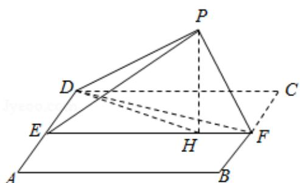

> [!faq]- 2018年全国统一高考数学试卷（理科）（新课标ⅰ）（含解析版）解析
>
> > [!success]- **【答案】** 详见解析
>
> > [!note]- **【分析】**
> > （1）利用正方形的性质可得BF垂直于面PEF，然后利用平面与平面垂直
>
> > [!note]- **【解析】**
> > （1）证明：由题意，点 E、F 分别是 AD、BC 的中点，
> >
> > 则 $\mathrm{AE} = \frac{1}{2}\mathrm{AD},\quad \mathrm{BF} = \frac{1}{2}\mathrm{BC},$
> >
> > 由于四边形 ABCD 为正方形，所以 EF⊥BC.
> >
> > 由于 PF⊥BF，EF∩PF=F，则 BF⊥平面 PEF.
> >
> > 又因为 BFC 平面 ABFD，所以：平面 PEF⊥平面 ABFD.
> > (2) 在平面 DEF 中, 过 P 作 PH⊥EF 于点 H, 连接 DH,
> >
> > 由于 EF 为面 ABCD 和面 PEF 的交线，PH⊥EF，
> >
> > 则 PH⊥面 ABFD，故 PH⊥DH.
> >
> > 在三棱锥 P-DEF 中，可以利用等体积法求 PH，
> >
> > 因为 DE∥BF 且 PF⊥BF，
> >
> > 所以 PF⊥DE，
> >
> > 又因为 $\triangle PDF\cong\triangle CDF,$
> >
> > 所以 $\angle FPD=\angle FCD=90^{\circ}$ ,
> >
> > 所以 PF⊥PD，
> >
> > 由于 $\mathrm{DE} \cap \mathrm{PD} = \mathrm{D}$ , 则 $\mathrm{PF} \perp$ 平面 $\mathrm{PDE}$ ,
> >
> > 故 $V_{F-PDE}=\frac{1}{3}PF\cdot S_{\triangle PDE}$ ,
> >
> > 因为 BF∥DA 且 BF⊥面 PEF，
> >
> > 所以 DA⊥面 PEF，
> >
> > 所以 DE⊥EP.
> >
> > 设正方形边长为 2a，则 PD=2a，DE=a
> >
> > 在 $\triangle$ PDE 中， $\mathrm{PE} = \sqrt{3}\mathrm{a}$ ，
> >
> > 所以 $S_{\triangle PDE}=\frac{\sqrt{3}}{2}a^{2}$ ,
> >
> > 故 $V_{F-PDE}=\frac{\sqrt{3}}{6}a^{3}$ ,
> >
> > 又因为 $S_{\triangle DEF} = \frac{1}{2} a \cdot 2a = a^2$
> >
> > 所以 $\mathrm{PH} = \frac{3\mathrm{V}_{\mathrm{F - PDE}}}{\mathrm{a}^2} = \frac{\sqrt{3}}{2}\mathrm{a},$
> >
> > 所以在 $\triangle PHD$ 中， $\sin\angle PDH=\frac{PH}{PD}=\frac{\sqrt{3}}{4}$ ，
> >
> > 即 $\angle PDH$ 为DP与平面ABFD所成角的正弦值为： $\frac{\sqrt{3}}{4}$
> >
> > 
> >
> > 【点评】本题主要考查点、直线、平面的位置关系. 直线与平面所成角的求法. 几何
> >
> > 法的应用，考查转化思想以及计算能力.
