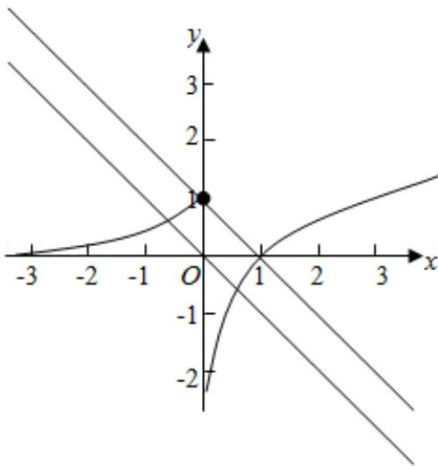

> [!faq]- 2018年全国统一高考数学试卷（理科）（新课标ⅰ）（含解析版）解析
>
> > [!success]- **【答案】** C
>
> > [!note]- **【分析】**
> > 由 $g(x) = 0$ 得 $f(x) = -x - a$ ，分别作出两个函数的图象，根据图象交点个
>
> > [!note]- **【解析】**
> > 分析】由 $g(x) = 0$ 得 $f(x) = -x - a$ ，分别作出两个函数的图象，根据图象交点个
> >
> > 数与函数零点之间的关系进行转化求解即可.
> >
> > 【
> > 解答】解：由 g (x) = 0 得 f (x) = -x - a,
> >
> > 作出函数 $f(x)$ 和 $y = -x - a$ 的图象如图：
> >
> > 当直线 $y = -x - a$ 的截距 $-a \leq 1$ ，即 $a \geq -1$ 时，两个函数的图象都有2个交点，
> >
> > 即函数 g (x) 存在 2 个零点，
> >
> > 故实数 a 的取值范围是 $[-1, +\infty)$ ，
> >
> > 故选：C.
> >
> > 
> >
> > 【点评】本题主要考查分段函数的应用，利用函数与零点之间的关系转化为两个
> >
> > 函数的图象的交点问题是解决本题的关键.
