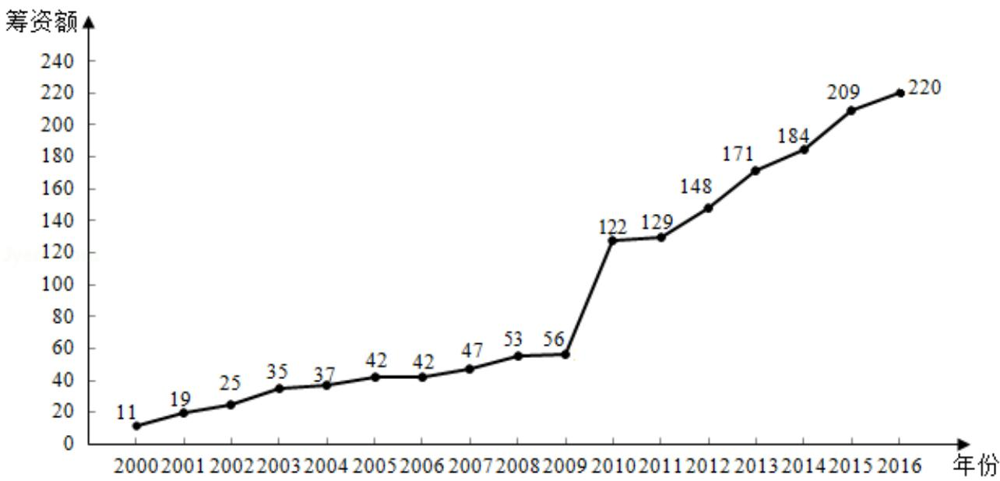

<!-- question-source:start -->
18. (12 分) 如图是某地区 2000 年至 2016 年环境基础设施投资额 y (单位: 亿元) 的折线图.

为了预测该地区2018年的环境基础设施投资额，建立了y与时间变量t的两个线性回归模型。根据2000年至2016年的数据（时间变量t的值依次为1，2，…，17）建立模型①： $\hat{y}=-30.4+13.5t$ ；根据2010年至2016年的数据（时间变量t的值依次为1，2，…，7）建立模型②： $\hat{y}=99+17.5t$ 。
<!-- question-source:end -->

![[高中/真题/按年份分类/2018/2018年全国统一高考数学试卷_理科__新课标ⅱ__含解析版_/填空题/题目/answers/Q00028795A1.md]]
