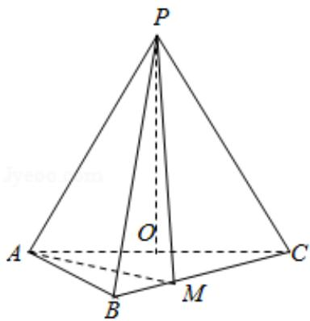

<!-- question-source:start -->
(2) 若点 M 在棱 BC 上，且二面角 M - PA - C 为 $30^{\circ}$ ，求 PC 与平面 PAM 所成角

的正弦值.

<!-- question-source:end -->

![[高中/真题/按年份分类/2018/2018年全国统一高考数学试卷_理科__新课标ⅱ__含解析版_/填空题/题目/answers/Q00031725A1.md]]
