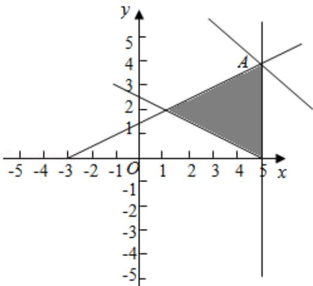

> [!faq]- 2018年全国统一高考数学试卷（理科）（新课标ⅱ）（含解析版）解析
>
> > [!success]- **【答案】** . 【
>
> > [!note]- **【分析】**
> > 由约束条件作出可行域，数形结合得到最优解，求出最优解的坐标，代入
>
> > [!note]- **【解析】**
> > 分析】由约束条件作出可行域，数形结合得到最优解，求出最优解的坐标，代入
> >
> > 目标函数得
> > 答案.
> >
> > 【
> > 解答】解：由 x，y 满足约束条件 $\left\{\begin{aligned}x+2y-5&\geqslant0\\ x-2y+3&\geqslant0\\ x-5&\leqslant0\end{aligned}\right.$ 作出可行域如图，
> >
> > 化目标函数 $z=x+y$ 为 $y=-x+z$ ,
> >
> > 由图可知，当直线 $y = -x + z$ 过 A 时，z 取得最大值，
> >
> > 由 $\left\{\begin{aligned}x=5\\ x-2y+3=0\end{aligned}\right.$ ，解得A（5，4），
> >
> > 目标函数有最大值，为 z=9.
> >
> > 故
> > 答案为：9.
> >
> > 
> >
> > 【点评】本题考查了简单的线性规划,考查了数形结合的解题思想方法,是中档题.
