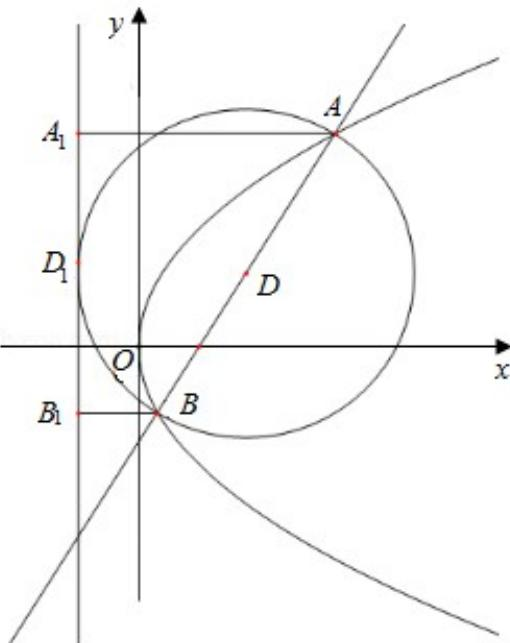

> [!faq]- 2018年全国统一高考数学试卷（理科）（新课标ⅱ）（含解析版）解析
>
> > [!success]- **【答案】** 详见解析
>
> > [!note]- **【分析】**
> > （1）方法一：设直线AB的方程，代入抛物线方程，根据抛物线的焦点弦
>
> > [!note]- **【解析】**
> > 解：
> > （1）方法一：抛物线 C: $y^{2}=4x$ 的焦点为 F（1，0），
> >
> > 设直线 AB 的方程为： $y = k(x - 1)$ ，设 A $(x_{1}, y_{1})$ ，B $(x_{2}, y_{2})$ ，
> >
> > 则 $\left\{ \begin{array}{l} y = k(x - 1) \\ y^2 = 4x \end{array} \right.$ ，整理得： $k^2 x^2 - 2 (k^2 + 2) x + k^2 = 0$ ，则 $x_1 + x_2 = \frac{2(k^2 + 2)}{k^2}$ ， $x_1 x_2 = 1$
> >
> > 由 $|AB|=x_{1}+x_{2}+p=\frac{2(k^{2}+2)}{k^{2}}+2=8$ ，解得： $k^{2}=1$ ，则k=1，
> >
> > ∴直线l的方程y=x-1;
> >
> > 方法二：抛物线 C: $y^{2}=4x$ 的焦点为 F(1,0)，设直线 AB 的倾斜角为 $\theta$ ，由抛物线
> >
> > 的弦长公式 $|AB|=\frac{2p}{\sin^{2}\theta}=\frac{4}{\sin^{2}\theta}=8$ ，解得： $\sin^{2}\theta=\frac{1}{2}$
> >
> > $\therefore \theta = \frac{\pi}{4}$ ，则直线的斜率 $k = 1$
> >
> > ∴直线l的方程y=x-1;
> >
> > $$
> > 2 = - (x - 3)
> > $$
> >
> > $$
> > \mathrm{y} = - \mathrm{x} + 5
> > $$
> >
> > 设所求圆的圆心坐标为 $(\mathrm{x}_0, \mathrm{y}_0)$ ，则 $\left\{ \begin{array}{l} y_0 = -x_0 + 5 \\ (x_0 + 1)^2 = \frac{(y_0 - x_0 + 1)^2}{2} + 16 \end{array} \right.$ ，
> >
> > 解得： $\left\{ \begin{array}{l}x_0 = 3\\ y_0 = 2 \end{array} \right.$ 或 $\left\{ \begin{array}{l}x_0 = 11\\ y_0 = -6 \end{array} \right.,$
> >
> > 因此，所求圆的方程为 $(x-3)^{2}+(y-2)^{2}=16$ 或 $(x-11)^{2}+(y+6)^{2}=144$ .
> >
> > 
> >
> > 【点评】本题考查抛物线的性质, 直线与抛物线的位置关系, 抛物线的焦点弦公式,
> >
> > 考查圆的标准方程，考查转换思想思想，属于中档题.
