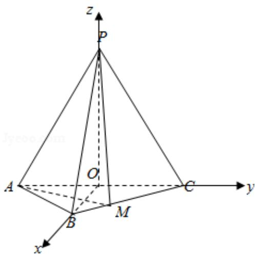

> [!faq]- 2018年全国统一高考数学试卷（理科）（新课标ⅱ）（含解析版）解析
>
> > [!success]- **【答案】** 详见解析
>
> > [!note]- **【分析】**
> > （1）利用线面垂直的判定定理证明 PO⊥AC，PO⊥OB 即可；
>
> > [!note]- **【解析】**
> > 分析】（1）利用线面垂直的判定定理证明 PO⊥AC，PO⊥OB 即可；
> >
> > (2) 根据二面角的大小求出平面 PAM 的法向量，利用向量法即可得到结论.
> >
> > 【
> > 解答】（1）证明：连接 BO，
> >
> > ∵AB=BC=2 $\sqrt{2}$ ，O是AC的中点，
> >
> > ∴BO⊥AC，且 BO=2，
> >
> > 又 PA=PC=PB=AC=4,
> >
> > $$
> > \therefore \mathrm{PO} \perp \mathrm{AC}, \quad \mathrm{PO} = 2 \sqrt {3},
> > $$
> >
> > 则 $PB^{2}=PO^{2}+BO^{2}$ ,
> >
> > 则 PO⊥OB，
> >
> > $\because OB \cap AC = O,$
> >
> > ∴PO⊥平面 ABC;
> >
> > (2) 建立以 O 坐标原点, OB, OC, OP 分别为 x, y, z 轴的空间直角坐标系如图:
> >
> > A $(0, -2, 0)$ , P $(0, 0, 2\sqrt{3})$ , C $(0, 2, 0)$ , B $(2, 0, 0)$ ,
> >
> > $\overrightarrow{BC} = (-2, 2, 0)$
> >
> > 设 $\overrightarrow{BM}=\lambda\overrightarrow{BC}=(-2\lambda,2\lambda,0)$ ， $0<\lambda<1$
> >
> > 则 $\overrightarrow{BM}-\overrightarrow{BA}=(-2\lambda,2\lambda,0)-(-2,-2,0)=(2-2\lambda,2\lambda+2,0)$ ，
> >
> > 则平面 PAC 的法向量为 $\vec{\pi} = (1, 0, 0)$ ，
> >
> > 设平面 MPA 的法向量为 $\vec{n}=(x,y,z)$ ，
> >
> > 则 $\overrightarrow{\mathrm{PA}} = (0, -2, -2\sqrt{3})$
> >
> > $$
> > \overrightarrow {\mathrm{n}} \cdot \overrightarrow {\mathrm{PA}} = - 2 \mathrm{y} - 2 \sqrt {3} \mathrm{z} = 0, \quad \overrightarrow {\mathrm{n}} \cdot \overrightarrow {\mathrm{AM}} = (2 - 2 \lambda) \mathrm{x} + (2 \lambda + 2) \mathrm{y} = 0
> > $$
> >
> > 令 $z = 1$ ，则 $\mathrm{y} = -\sqrt{3}$ ， $\mathrm{x} = \frac{(\lambda + 1)\sqrt{3}}{1 - \lambda},$
> >
> > 即 $\vec{n} = \left(\frac{(\lambda + 1)\sqrt{3}}{1 - \lambda}, -\sqrt{3}, 1\right)$ ，
> >
> > ∵二面角 M - PA - C 为 $30^{\circ}$ ,
> >
> > $$
> > \therefore \cos 3 0 ^ {\circ} = \left| \frac {\vec {m} \cdot \vec {n}}{| \vec {m} | | \vec {n} |} = \frac {\sqrt {3}}{2}, \right.
> > $$
> >
> > 即 $\frac{\frac{(\lambda + 1)\sqrt{3}}{\lambda - 1}}{\sqrt{(\frac{\lambda + 1}{1 - \lambda} \cdot \sqrt{3})^2 + 1 + 3} \cdot 1} = \frac{\sqrt{3}}{2},$
> >
> > 解得 $\lambda=\frac{1}{3}$ 或 $\lambda=3$ （舍），
> >
> > 则平面 MPA 的法向量 $\vec{n}=(2\sqrt{3},- \sqrt{3},1)$ ，
> >
> > $\overrightarrow{\mathrm{PC}} = (0, 2, -2\sqrt{3})$
> >
> > PC 与平面 PAM 所成角的正弦值 $\sin\theta=|\cos<\overrightarrow{PC},\quad\overrightarrow{n}>|=|\frac{-2\sqrt{3}-2\sqrt{3}}{\sqrt{16}\cdot\sqrt{16}}|= \frac{4\sqrt{3}}{16}=\frac{\sqrt{3}}{4}$ .
> >
> > 
> >
> > 【点评】本题主要考查空间直线和平面的位置关系的应用以及二面角，线面角的
> >
> > 求解，建立坐标系求出点的坐标，利用向量法是解决本题的关键.
