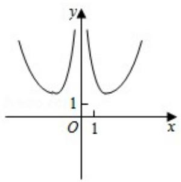
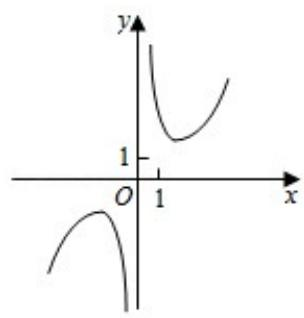
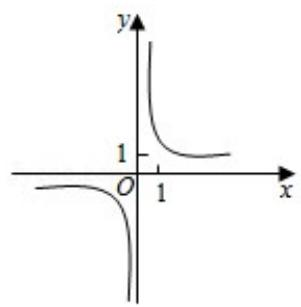
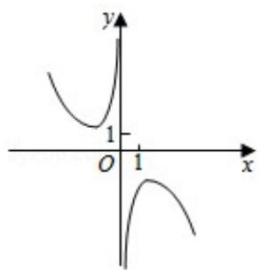

<!-- question-source:start -->
3.（5分）函数 $f(x) = \frac{e^x - e^{-x}}{x^2}$ 的图象大致为（ ）

A.

B.

C.

D.

【考点】3A：函数的图象与图象的变换；6B：利用导数研究函数的单调性.

【专题】33：函数思想；4R：转化法；51：函数的性质及应用.
<!-- question-source:end -->

![[高中/真题/按年份分类/2018/2018年全国统一高考数学试卷_理科__新课标ⅱ__含解析版_/选择题/题目/answers/Q00031726A1.md]]
