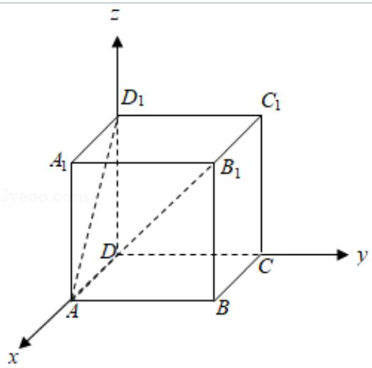

> [!faq]- 2018年全国统一高考数学试卷（理科）（新课标ⅱ）（含解析版）解析
>
> > [!success]- **【答案】** C
>
> > [!note]- **【分析】**
> > 以 D 为原点，DA 为 x 轴，DC 为 y 轴， $DD_{1}$ 为 z 轴，建立空间直角坐标系，
>
> > [!note]- **【解析】**
> > 分析】以 D 为原点，DA 为 x 轴，DC 为 y 轴， $DD_{1}$ 为 z 轴，建立空间直角坐标系，
> >
> > 利用向量法能求出异面直线 $AD_{1}$ 与 $DB_{1}$ 所成角的余弦值.
> >
> > 【
> > 解答】解: 以 D 为原点, DA 为 x 轴, DC 为 y 轴, $DD_{1}$ 为 z 轴, 建立空间直角坐标系,
> >
> > ∵在长方体 $ABCD-A_{1}B_{1}C_{1}D_{1}$ 中，AB=BC=1， $AA_{1}=\sqrt{3}$ ∴A（1，0，0）， $D_{1}(0,0,\sqrt{3})$ ，D（0，0，0）， $B_{1}(1,1,\sqrt{3})$ $\overrightarrow{AD_{1}}=(-1,0,\sqrt{3}),\overrightarrow{DB_{1}}=(1,1,\sqrt{3})$ 设异面直线 $AD_{1}$ 与 $DB_{1}$ 所成角为 $\theta$ ，
> >
> > 则 $\cos \theta = \frac{|\overrightarrow{\mathrm{AD}_1} \cdot \overrightarrow{\mathrm{DB}_1}|}{|\overrightarrow{\mathrm{AD}_1}| \cdot |\overrightarrow{\mathrm{DB}_1}|} = \frac{2}{2\sqrt{5}} = \frac{\sqrt{5}}{5},$
> >
> > ∴异面直线 $AD_{1}$ 与 $DB_{1}$ 所成角的余弦值为 $\frac{\sqrt{5}}{5}$ .
> >
> > 故选：C.
> >
> > 
> >
> > 【点评】本题考查异面直线所成角的余弦值的求法, 考查空间中线线、线面、面面
> > 间的位置关系等基础知识, 考查运算求解能力, 考查函数与方程思想, 是基础
> > 题.
