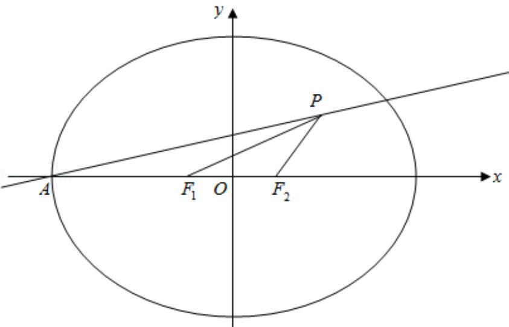

> [!faq]- 2018年全国统一高考数学试卷（理科）（新课标ⅱ）（含解析版）解析
>
> > [!success]- **【答案】** D
>
> > [!note]- **【分析】**
> > 求得直线 AP 的方程: 根据题意求得 P 点坐标, 代入直线方程, 即可求得椭圆的离心率.
>
> > [!note]- **【解析】**
> > 解：由题意可知：A（-a，0）， $F_{1}$ （-c，0）， $F_{2}$ （c，0），直线AP的方程为： $y=\frac{\sqrt{3}}{6}(x+a)$ ，
> > 由 $\angle F_{1}F_{2}P=120^{\circ}$ ， $|PF_{2}|=|F_{1}F_{2}|=2c$ ，则 P（2c， $\sqrt{3}c$ ），代入直线 AP： $\sqrt{3}c=\frac{\sqrt{3}}{6}(2c+a)$ ，整理得：a=4c，
> > ∴题意的离心率 $e=\frac{c}{a}=\frac{1}{4}$ .
> >
> > 故选：D.
> >
> > 
> >
> > 【点评】本题考查椭圆的性质，直线方程的应用，考查转化思想，属于中档题.
> > 二、填空题：本题共4小题，每小题5分，共20分。
