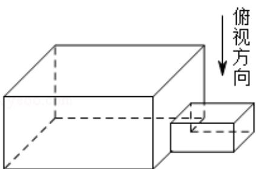
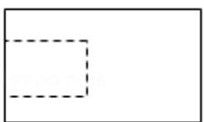
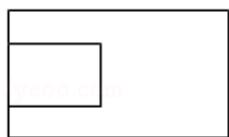
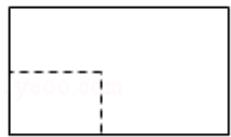
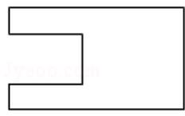
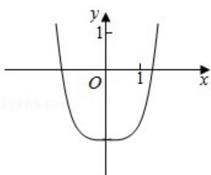
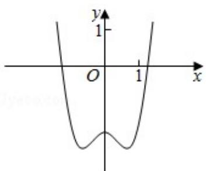
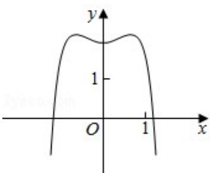

# 2018年全国统一高考数学试卷（理科）（新课标III）

##
一、选择题: 本题共 12 小题, 每小题 5 分, 共 60 分。在每小题给出的四个选项中, 只有一项是符合题目要求的。

1. （5分）已知集合 $A = \{x \mid x - 1 \geq 0\}$ ， $B = \{0, 1, 2\}$ ，则 $A \cap B = (\quad)$ A. $\{0\}$ B. $\{1\}$ C. $\{1, 2\}$ D. $\{0, 1, 2\}$

2. (5分) $(1 + \mathrm{i})$ $(2 - \mathrm{i}) = (\quad)$ A. -3-i B. -3+i C. 3-i D. $3 + \mathrm{i}$

3. (5 分) 中国古建筑借助榫卯将木构件连接起来. 构件的凸出部分叫榫头, 凹进
部分叫卵眼, 图中木构件右边的小长方体是榫头. 若如图摆放的木构件与某一
带卵眼的木构件咬合成长方体, 则咬合时带卵眼的木构件的俯视图可以是 ( )

A.

B.

C.

D.

4. （5分）若 $\sin \alpha = \frac{1}{3}$ ，则 $\cos 2\alpha = (\quad)$ A. $\frac{8}{9}$ B. $\frac{7}{9}$ C. $-\frac{7}{9}$ D. $-\frac{8}{9}$

5. (5 分) $(x^{2} + \frac{2}{x})^{5}$ 的展开式中 $x^{4}$ 的系数为（ ） A. 10 B. 20 C. 40 D. 80

6. $$
x + y + 2 = 0
$$

$$
(x - 2) ^ {2} + y ^ {2} = 2
$$

$$
\triangle A B P
$$

$$
[ \sqrt {2}, 3 \sqrt {2} ]
$$

$$
[ 2 \sqrt {2}, 3 \sqrt {2} ]
$$

7. (5分) 函数 $y = -x^4 + x^2 + 2$ 的图象大致为（）

A.

B.  
C.  

D.  

8. (5 分) 某群体中的每位成员使用移动支付的概率都为 $p$ , 各成员的支付方式相
互独立. 设 $x$ 为该群体的 10 位成员中使用移动支付的人数, $DX = 2.4$ , $P(x=4) < P(X=6)$ , 则 $p = (\quad)$ A. 0.7    B. 0.6    C. 0.4    D. 0.3

9. （5分） $\triangle ABC$ 的内角 $A, B, C$ 的对边分别为 $a, b, c$ . 若 $\triangle ABC$ 的面积为 $\frac{a^2 + b^2 - c^2}{4}$ , 则 $C = (\quad)$ A. $\frac{\pi}{2}$ B. $\frac{\pi}{3}$ C. $\frac{\pi}{4}$ D. $\frac{\pi}{6}$

10. (5 分) 设 A, B, C, D 是同一个半径为 4 的球的球面上四点, △ABC 为等边三角形且面积为 $9 \sqrt{3}$ , 则三棱锥 D - ABC 体积的最大值为 ( )

A. $12 \sqrt{3}$ B. $18 \sqrt{3}$ C. $24 \sqrt{3}$ D. $54 \sqrt{3}$

11. (5分) 设 $F_{1}, F_{2}$ 是双曲线 $C: \frac{x^{2}}{a^{2}} - \frac{y^{2}}{b^{2}} = 1 (a > 0, b > 0)$ 的左, 右焦点, $O$ 是坐标原点. 过 $F_{2}$ 作 $C$ 的一条渐近线的垂线, 垂足为 $P$ , 若 $|PF_{1}| = \sqrt{6} |OP|$ , 则 $C$ 的离心率为 ( )

A. $\sqrt{5}$ B. 2

C. $\sqrt{3}$ D. $\sqrt{2}$

12. （5 分）设 $a=\log_{0.2}0.3$ ， $b=\log_{2}0.3$ ，则（）

A. $a + b <   ab <   0$ B. $ab <   a + b <   0$ C. $a + b <   0 <   ab$ D. $ab <   0 <   a + b$

##
二、填空题：本题共4小题，每小题5分，共20分。

13. (5分) 已知向量 $\vec{a} = (1, 2)$ , $\vec{b} = (2, -2)$ , $\vec{c} = (1, \lambda)$ . 若 $\vec{c} // (2\vec{a} + \vec{b})$ , 则 $\lambda =$

14. (5分) 曲线 $y = (ax + 1)e^x$ 在点(0, 1)处的切线的斜率为 -2，则 $a =$ \_\_\_\_.

15. (5 分) 函数 $f(x) = \cos \left(3x + \frac{\pi}{6}\right)$ 在 $[0, \pi]$ 的零点个数为 \_\_\_\_.

16. (5 分) 已知点 M (-1, 1) 和抛物线 C: $y^{2}=4x$ ，过 C 的焦点且斜率为 k 的直线与

C 交于 A, B 两点. 若 $\angle AMB = 90^{\circ}$ , 则 $k =$

##

![[高中/真题/按年份分类/2018/2018年全国统一高考数学试卷_理科__新课标ⅲ__含解析版_/解答题/解答题.md]]
![[高中/真题/按年份分类/2018/2018年全国统一高考数学试卷_理科__新课标ⅲ__含解析版_/选择题/选择题.md]]
![[高中/真题/按年份分类/2018/2018年全国统一高考数学试卷_理科__新课标ⅲ__含解析版_/填空题/填空题.md]]
