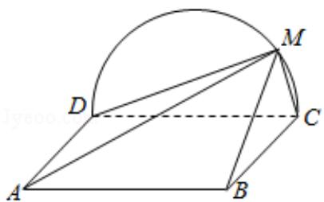

<!-- question-source:start -->
19. (12 分) 如图, 边长为 2 的正方形 ABCD 所在的平面与半圆弧 $\widehat{CD}$ 所在平面垂

直，M是CD上异于C，D的点.

(1) 证明: 平面 AMD⊥平面 BMC;

(2) 当三棱锥 M - ABC 体积最大时, 求面 MAB 与面 MCD 所成二面角的正弦值.

<!-- question-source:end -->

![[高中/真题/按年份分类/2018/2018年全国统一高考数学试卷_理科__新课标ⅲ__含解析版_/解答题/题目/answers/Q00024309A1.md]]
